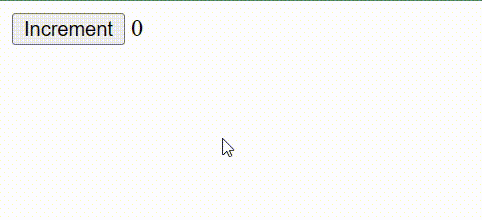

# شروع کار با Alpine.js
یک فایل خالی در سیستم خود به نام i-love-alpine.html 
ایجاد کنید.
فایل رو با ویرایشگر کد باز کنید و کد HTML زیر رو درونش قرار بدید:
```html
<html>
<head>
    <script defer src="https://cdn.jsdelivr.net/npm/alpinejs@3.x.x/dist/cdn.min.js"></script>
</head>
<body>
    <h1 x-data="{ message: 'I ❤️ Alpine' }" x-text="message"></h1>
</body>
</html>
```
این فایل رو در یک مرورگر باز کنید اگه عبارت 
"I ❤️ Alpine"
رو دیدید یعنی همه چیز اوکیه...

اکنون برای شروع آماده اید. بیایید به سه مثال عملی به عنوان پایه ای برای یادگیری اصول اولیه 
Alpine
نگاهی بیاندازیم.
در انتهای این مثال ها شمادرک مناسبی از ساختار
alpine.js
به دست خواهید آورد. پس بزن بریم...

1. ساخت یک شمارنده
2. ساخت یک منوی باز شونده
3.  ساخت یک input برای جستجو

## # ساخت یک شمارنده
بیایید با یک کامپوننت شمارنده ساده شروع کنیم تا اصول اولیه تعریف 
State
و 
Event
را در 
Alpine
به شما نشان دهیم.

در داخل تگ 
`<body>`
خود این دستورات را وارد کنید:
```html
<div x-data="{ count: 0 }">
    <button x-on:click="count++">Increment</button>
 
    <span x-text="count"></span>
</div>
```
اکنون می بینید ما با سه 
Attribute
که ما به تگ های
HTML
اضافه کردیم یک شمارنده ساده ساختیم.



بیایید آنچه اتفاق افتاد رو تفسیر کنیم :

### Declaring data
```html
 <div x-data="{ count: 0 }"> 
```

همه چیز در 
Alpine
با دستور
`x-data`
شروع می شود.
در داخل
`x-data`
با جاوااسکریپت  خالص یک 
Object 
یا شیء از داده را که 
Alpine
شناسایی می کند ، تعریف می کنیم.

هر
property
داخل این 
object
که ساخته خواهد شد در دسترس
directive
ها یا دستورالعمل های دیگر قرار می گیرد. علاوه بر این زمانی که یک 
property
تغییر می کند هر چیزی که به آن وابسته باشد نیز تغییر می کند.

بریم یک نگاهی به 
`x-on`
بیاندازیم و ببینیم چگونه می تواند به
property
که اسمش رو گزاشتیم 
count
دسترسی و 
modify
داشته باشد و اون رو تغییر دهد.
### Listening for events
```html
<button x-on:click="count++">Increment</button>
```
اتریبیوت
`x-on`
یک 
directive
هست که می تواند از آن برای تعریف 
Event
 هاروی یک عنصر استفاده کرد.
در این مثال ما آماده ایم برای یک رویداد
click
و بنابراین دستور رویداد یا
Event
ما
`x-on:click`
می باشد.
همین طور که متصور شدید می تونید به
Event
های دیگه هم گوش بدید یا تعریفش کنید.
برای مثال رویداد 
`mouseenter`
به این صورت است:

`x-on:mouseenter`

هنگامی که یک رویداد رخ می دهد 
Alpine
عبارت یا دستور جاوااسکریپت مرتبط رو فراخوانی می کند.در مثال ما این عبارت یا دستور :
```js 
count++
```
می باشد. همان طور که قبلا گفتم ما داده های تعریف شده در 
`x-data`
دسترسی داریم.

> اغلب به جای
> `x-on`
> شما در کد ها
> `@`
> می بینید. این یک شیوه کوتاه تر و مورد پسند تر است که بسیاری آن را ترجیح می دهند.

### Reacting to changes
```html
<span x-text="count"></span>
```
با دستورالعمل 
`x-text` 
در
Alpine
می توانید برای تعریف محتوای متنی یک عنصر و همینطور عبارت جاواسکریپت استفاده کنید.
در این مورد به
Alpine
می گوییم همیشه محتوای این تگ
`<span>`
، مقدار
property
به نام
count
رو برای ما نمایش بده.

در صورتی که این مورد واضح نبود،
`x-text`
مانند اکثر 
directive
ها یک عبارت ساده جاواسکریپت را به عنوان آرگومان می پذیرد. بنابراین به عنوان مثال می توانید محتوای آن را
```js
 x-text="count * 2"
```
قرار دهید و محتوای متنی تگ
`<span>`
همیشه دو برابر مقدار 
`count`
خواهد بود.

